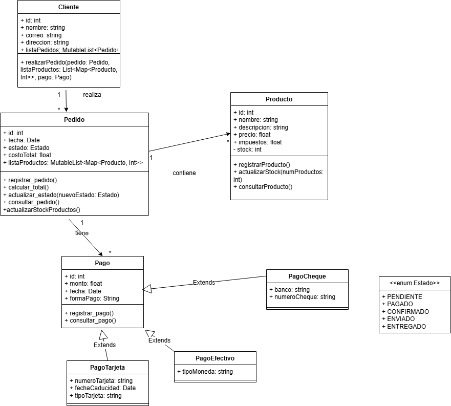

# UML_DMI_Practica5.2

## Diagrama UML



- Los pedidos los realizan los clientes, y pueden contener uno o varios productos.
-> Dos clases (Cliente y producto) es una relación de asociación (1..*) y Cliente con metodo realizarPedido()  
- Debe registrar la información de cada pedido, incluyendo la fecha en que se realizó.
-> Nueva clase (Pedido) con atributos como el id, el estado, las lista de los productos, etc.
- Estos productos deben estar registrados en el sistema junto con su información correspondiente (nombre, descripción, precio, impuestos, etc.).
-> Atributos a añadir para la clase Producto como el nombre, la descripción...
- El sistema debe ser capaz de calcular el coste total de cada pedido, teniendo en cuenta la cantidad de cada producto incluido en el pedido, sus precios individuales y los impuestos correspondientes.
-> Función/Método para la clase Pedido que tenga en cuenta la cantidad, su precio y los impuestos.
- Debe haber un registro actualizado del stock de cada producto, de forma que se pueda informar al cliente si habrá algún retraso en la entrega debido a falta de stock.
-> He introducido un atributo a Producto que sea su stock.
- Cada pedido puede ser pagado de una sola vez o en varios pagos.
- Se debe ser capaz de registrar la información de cada pago realizado por el cliente.
-> Nueva clase (Pago) la relación entre Pedido y Pago será (1..*). Además de atributos que informen sobre el pago, como la id, el monto, etc.
- Las formas de pago aceptadas por el sistema son: Card (número, fecha de caducidad y tipo de tarjeta), Cash  (Tipo de moneda) y cheque (nombre y banco).
-> He decidido que serán subclases de Pago (relación de herencia), por lo que heredaran sus atributos y métodos. Además de sus atributos propios. 
- Cada pedido puede estar en uno de los siguientes estados: pdte, pgdo, pcdo, envdo, entgdo. El estado de cada pedido debe ser actualizado en el sistema en función de su evolución.
-> He decido utilizar una clase enumerada para los estados del pedido llamada `Estado`. Con un método actualizar estado que recibe un parámetro de tipo Estado.

Relacioones de asociación:
Cliente -> Pedido -> Producto
Pedido -> Pago

Relaciones de herencia:
Efectivo, Tarjeta y Cheque ---extends---> Pago

## Apartado A 

- **Clase** → Clase en POO: Representa una entidad con atributos y métodos. Ej -> Cliente
- **Atributo**  → Variable de instancia: Define el estado o propiedades de una clase. Ej -> id
- **Objeto** → Instancia de una Clase: Un objeto creado a partir de una clase. Ej -> De `Producto` se puede crear un objeto "Laptop".
- **Operación** → Método: Representa una función o comportamiento de la clase. Ej -> realizarPedido()
- **Asociación** → Relación entre objetos: Conexión entre clases, equivalente a referencias o atributos de tipo objeto. Ej -> `Pedido` está asociado a un `Cliente`
- **Agregación**: Representa una relación débil entre clases, donde una puede existir sin la otra. Ej -> Pedido tiene `listaProductos`, sin pedido, `Producto` sigue existiendo
- **Composición**: Aquí no puede existir sin la otra EJ -> Pedido tiene `listaProductos`, sin productos, no puede existir
- **Herencia** → Herencia en POO: Representa la relación padre-hijo entre clases, donde una subclase hereda atributos y métodos de la superclase. EJ -> La clase Pago tiene tres subclases (Efectivo, Tarjeta, Cheque)
- **Interfaz** → Interfaz en POO: Define un conjunto de métodos sin implementación que deben ser implementados por las clases que la usan (como un contrato).
- **Dependencia** → Uso de una clase dentro de otra: Representa una relación en la que un objeto depende de otro para funcionar.
- **Realización** → Implementación de una interfaz: Conexión entre una interfaz y la clase que la implementa.
- **Estado** → Patrón de estado: Mapea el concepto de una máquina de estados a objetos con diferentes comportamientos según su estado. Ej -> Un `Pedido` puede cambiar de estado (Pendiente, Enviado, Entregado...).

## APARTADO B

Elegí Draw.io porque es una herramienta gratuita, fácil de usar y accesible desde cualquier navegador sin necesidad de instalar nada. Es intuitiva y tiene plantillas predefinidas para diagramas UML, lo que facilita la creación de diagramas haciendo más rápido el proceso. Además, ofrece integración con servicios como Google Drive o GitHub, permitiendo la colaboración en tiempo real.

## APARTADO C

Para crear una clase de un diagrama UML a POO (Kotlin). 

En la caja de cada clase hay 3 cuadros. El primero es el nombre de la clase, el segundo son los atributos y el tercero son los métodos. 

Para crear una clase en Kotlin es: (val -> inmutable , var -> mutable)  |  Dentro de los () van los atributos y dentro de las {} los métodos/funciones/comportamientos de la clase.
---> class nombreClase ( val o var nombreAtributo: tipoValor){ fun nombreMétodo(nombreParámetro: tipoValor) }  

Añadir que +, -, # para UML es: public, private, protected para POO.
Por ejemplo: Una clase privada sería "private class", un atributo privado sería "private var" y un método/función privado sería private fun.

Ejemplo:
```Kotlin
class Cliente(
    val id: Int,
    val nombre: String,
    val correo: String,
    val direccion: String
) {
    val listaPedidos: MutableList<Pedido> = mutableListOf()  \\ Creo el atributo dentro ya que no quiero que se pase como parametro, va a servir para añadir los pedidos cada vez que realice uno.
    
    fun realizarPedido(pedido: Pedido, listaProductos: List<Map<Producto, Int>>, pago: Pago) {
        //Lógica del método o función
    }
}

```
Así con todas las clases.

He utilizado también clases enumaradas, representan un conjunto fijo de valores, en este caso: los estados del pedido:

    - PENDIENTE
    - PAGADO
    - CONFIRMADO
    - ENVIADO
    - ENTREGADO

En UML es una caja con dos cuadros con dos cuadros, el primero el nombre de la clase que va entre <<>> con enum delante del nombre; y el segundo con las valores fijos. En poo (Kotlin):
---> enum Class nombreClase(){ conjunto de valores separados por ',' }

Ejemplo:
```Kotlin
enum class Estado {
      PENDIENTE, PAGADO, CONFIRMADO, ENVIADO, ENTREGADO, ;

// Función modificada para mostrar los valores en minúsculas
     override fun toString(): String {
         return super.toString().lowercase()
     }

}

```
Para las clases heredadas que son las subclases de Pago (la que recibe la flecha vacía).
Utilizo abstract class es una clase que no puede ser inistanciada directamente, la utilizo para heredar los atributos y métodos/funciones.

Ejemplo:
```Kotlin 
abstract class Pago(
    val id: Int,
    val monto: Float,
    val fecha: Date,
    val formaPago: String
) {
//abstract lo que hace es permitir solo a las clases herederas poder acceder y modificarla a su gusto
    abstract fun registrarPago() {}
    abstract fun consultarPago() {}
        //consulta el pago
}
\\Para la subclase:
class PagoTarjeta(
    id: Int,
    monto: Float,
    fecha: Date,
    formaPago: String,
    val numeroTarjeta: String,
    val fechaCaducidad: String,
    val tipoTarjeta: String
) : Pago(id, monto, fecha, formaPago) // Esto indica la herencia {
    override fun consultarPago() // Sobrescribe la función heredada
}


```
Todo el código en la carpeta src.


